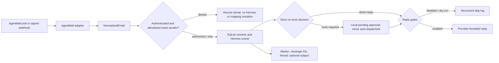

# hermes-email-bridge

`hermes-email-bridge` routes inbound email into [Hermes Agent](https://github.com/NousResearch/hermes-agent). It normalizes provider payloads, maps email threads to Hermes sessions, invokes Hermes, and can send the response back through the email provider.

AgentMail is the first adapter, not a core dependency. The bridge contract is intentionally small enough for future IMAP, Gmail API, Postmark, SendGrid, or SES adapters.

> Version: **0.5.1 (alpha)**. Start with replies disabled and dry-run enabled.

## What works

- Direct or Composio-backed AgentMail polling, message inspection, threaded replies, and verified webhooks
- Provider-neutral typed message and attachment models
- Authorization-aware SQLite mappings bound to a provider-authenticated participant
- Hermes session creation and resume through a version-pinned programmatic adapter
- JSON structured logs with secret-field redaction
- Persistent poll cursor, processed-message idempotency, and optional raw payload storage
- Exact sender allowlisting with automatic enrollment from trusted outbound mail
- No-tools automatic replies with a non-dispatchable local inbox for requests that need tools
- No runtime Python dependencies

## Install

Python 3.11 or newer is required. The default macOS Python 3.9 is not supported.

### Recommended: uv

```bash
git clone https://github.com/aulbricht/hermes-email-bridge.git
cd hermes-email-bridge
uv sync
cp .env.example .env
```

For development tools and tests, use `uv sync --extra dev`. Run commands with
`uv run`, for example `uv run hermes-email-bridge init-db`.

### pip fallback

Create the virtual environment with Python 3.11 or newer explicitly, then update
pip before requesting an editable Hatchling install:

```bash
python3.11 -m venv .venv
source .venv/bin/activate
python -m pip install --upgrade pip
python -m pip install -e .
cp .env.example .env
```

Edit `.env`, then export it before invoking the CLI:

```bash
set -a
source .env
set +a
```

The bridge does not parse `.env` itself, avoiding a runtime dependency and keeping secret loading under the process supervisor's control.

## Configure

| Variable | Default | Purpose |
| --- | --- | --- |
| `EMAIL_BRIDGE_PROVIDER` | `agentmail` | `agentmail` or `composio-agentmail` |
| `AGENTMAIL_API_KEY` | required | AgentMail bearer API key |
| `AGENTMAIL_INBOX_ID` | required | Inbox address or ID |
| `AGENTMAIL_WEBHOOK_SECRET` | required by `serve` | Svix signing secret (`whsec_…`) |
| `EMAIL_BRIDGE_DB_PATH` | `~/.local/state/hermes-email-bridge/bridge.db` | SQLite database |
| `EMAIL_BRIDGE_SEND_REPLIES` | `false` | Allow outbound replies |
| `EMAIL_BRIDGE_DRY_RUN` | `true` | Skip provider send even when replies are enabled |
| `EMAIL_BRIDGE_REPLY_DOMAINS` | empty | Optional comma-separated exact domains allowed to receive replies |
| `AGENTMAIL_BASE_URL` | `https://api.agentmail.to/v0` | HTTPS AgentMail API base URL |
| `AGENTMAIL_ALLOW_INSECURE_LOCAL_HTTP` | `false` | Permit HTTP only to `localhost` or a loopback IP for local tests |
| `EMAIL_BRIDGE_COMPOSIO_API_KEY` | required for Composio | Bridge-only project key scoped to Proxy Execute |
| `COMPOSIO_AGENT_MAIL_CONNECTED_ACCOUNT_ID` | required for Composio | Active AgentMail connected account |
| `COMPOSIO_AGENT_MAIL_INBOX_ID` | required for Composio | AgentMail inbox address or ID |
| `EMAIL_BRIDGE_STORE_RAW` | `false` | Persist raw provider payloads for debugging |
| `EMAIL_BRIDGE_RAW_RETENTION_DAYS` | `30` | Logical retention limit for opted-in raw payloads |
| `EMAIL_BRIDGE_ALLOW_SUBJECT_RESUME` | `false` | Enable authenticated exact-participant subject fallback |
| `EMAIL_BRIDGE_POLL_INTERVAL` | `30` | Continuous poll interval in seconds |
| `EMAIL_BRIDGE_LOG_LEVEL` | `INFO` | Python log level |
| `HERMES_COMMAND` | exact isolated sudo wrapper | Isolated wrapper or absolute Python `-I -B` adapter invocation |
| `HERMES_TIMEOUT` | `300` | Invocation timeout in seconds |
| `EMAIL_BRIDGE_WEBHOOK_HOST` | `127.0.0.1` | Webhook listen host |
| `EMAIL_BRIDGE_WEBHOOK_PORT` | `8787` | Webhook listen port |
| `EMAIL_BRIDGE_WEBHOOK_QUEUE_SIZE` | `8` | Accepted webhook events waiting for a worker |

The bridge appends `--resume SESSION` when mapped and always appends `--query PROMPT`; it
never invokes a shell. Startup accepts only the optional isolated wrapper or an absolute Python
`-I -B` invocation of `hermes-email-agent-adapter.py`. Direct `hermes chat`, arbitrary commands,
and unstructured quiet-mode output remain rejected.

### Critical output-isolation boundary and 0.5 no-tools mode

Version 0.4.0 replaces Hermes terminal stdout as an email transport. Earlier releases could
mistake reasoning panels, tool previews, timeouts, terminal UI, duplicated passages, or trusted
bridge metadata for the reply body. Because the email-driven process could also share access
with bridge secrets on an unsafe deployment, contaminated stdout was a potential secret-
exfiltration path.

The only accepted subprocess output is one canonical UTF-8 JSON line using protocol
`hermes-email-bridge/2`, with keys exactly `action`, `protocol`, `reply`, and `session_id`.
The only accepted actions are `reply` and `approval_required`. The bridge
requires a nonempty reply, a validated session ID, empty stderr, a zero exit status, canonical
serialization, and no extra bytes, BOM, ANSI/control characters, terminal borders, or bridge
trust-boundary markers. Output is captured with a hard bound. Any mismatch is recorded once as
`hermes_protocol_error`; no email or mapping/link mutation occurs, and logs contain only a fixed
reason code—not child stdout, stderr, reply text, lengths, snippets, or hashes.

This remains an intentional fail-closed migration. An existing `HERMES_COMMAND` that invokes
`hermes chat --quiet` directly will not start the bridge in any mode. The recommended simple
deployment uses the existing Hermes 0.18.2 Python environment and the reviewed adapter:

```bash
HERMES_COMMAND='/absolute/path/to/hermes/venv/bin/python -I -B /absolute/path/to/hermes-email-agent-adapter.py'
```

The adapter redirects operating-system file descriptors 1 and 2 to `/dev/null` before importing
Hermes and calls the pinned Hermes 0.18.2 `HermesCLI`/`AIAgent` result API. It accepts only the
exact normal `text_response(finish_reason=stop)` provenance with completed, untransformed,
unpreviewed output; pinned result and agent model/provider/session values; no pending steer; and
no failed, partial, interrupted, or cleanup state. Startup also hashes the adapter against the
reviewed release, and every invocation verifies that both Hermes and its context engine expose
zero tool schemas. It finalizes the session, then emits only the
canonical record through a saved non-inheritable descriptor. This preserves new and resumed
sessions, including a validated session ID rotated by Hermes compression. The fixed
`context_engine` toolset resolves to exactly zero tool schemas. Hermes must return a strict
two-field decision: answer directly without tools, or request approval. Tool-required requests
are recorded in the bridge SQLite database as pending approval metadata and are never posted to
Hermes Kanban or auto-dispatched. The email body and raw payload are not copied into the approval
table. The bridge sends the acknowledgment only after that idempotent local record exists.
Replies-disabled and dry-run modes create no approval records.

This queue is deliberately intake-only. A human reviews the original provider message, handles
approved work in the full agent workflow separately, and sends any resulting response manually; v0.5 has no
automatic approval-to-execution or execution-to-email callback. This avoids presenting AgentOS
Kanban triage as a security gate—it is not one, because triage may be auto-decomposed and
dispatched.

The same-account mode prevents prompt-driven file access by exposing zero tool schemas and
scrubbing bridge secrets from the child environment, but it is not an OS filesystem boundary:
a compromised Hermes runtime or Python dependency could still read files available to that
account. Operators who require protection from that threat should use the optional isolated
account below or a VM/container boundary.

When the isolated wrapper is selected, the macOS launcher hashes the installed verifier and
requires the exact protocol-v2 runtime before it starts the bridge. Upgrading the Python package
without upgrading that root-owned runtime therefore fails at startup instead of consuming mail
with an incompatible protocol.

## Use

Initialize the mapping database. For a fresh production deployment, seed both
poll cursors to the current UTC time so existing received and sent mail is not imported:

```bash
hermes-email-bridge init-db
hermes-email-bridge init-db --start-now
```

The bridge denies every sender until an exact address is authorized. Wildcards and
domain entries are not accepted:

```bash
hermes-email-bridge allowlist add person@example.com
hermes-email-bridge allowlist list
hermes-email-bridge allowlist remove person@example.com
```

Each poll cycle reads trusted `sent` messages before `received` messages. Valid To,
Cc, and Bcc recipients on new messages sent from the configured inbox are added to
the allowlist automatically. Removing an address remains effective across cursor
overlap and restarts; only a later, newly observed outbound message can authorize it again.

Poll once, or continuously:

```bash
hermes-email-bridge poll
hermes-email-bridge poll --continuous --interval 15
```

Inspect how a provider message normalizes (add `--raw` to include the raw payload):

```bash
hermes-email-bridge inspect '<message-id@agentmail.to>'
```

List requests that Hermes classified as needing tools. Use the recorded provider message ID with
`inspect` to review the original mail, handle it manually in the full agent workflow, then close
the local record:

```bash
hermes-email-bridge approvals list
hermes-email-bridge inspect '<provider-message-id>'
hermes-email-bridge approvals resolve 1
# or: hermes-email-bridge approvals reject 1
hermes-email-bridge approvals purge --closed-older-than-days 30
```

List persistent mappings:

```bash
hermes-email-bridge mappings
```

Markers are masked in this output. Rotate one marker and reveal the replacement once:

```bash
hermes-email-bridge mappings rotate 1 --ttl-days 90
```

Purge retained raw payloads without deleting processed-message idempotency records:

```bash
hermes-email-bridge purge-raw --older-than-days 30
```

Run the webhook receiver:

```bash
hermes-email-bridge serve
curl http://127.0.0.1:8787/healthz
```

Expose `/webhooks` through HTTPS and register it for AgentMail's `message.received` event. `serve` refuses to start without `AGENTMAIL_WEBHOOK_SECRET` and verifies the exact raw body using AgentMail's Svix headers before parsing it. Verified events enter a bounded queue and one worker processes them serially so messages cannot race to create or resume the same Hermes session; saturation returns HTTP 503 so the provider can retry. See AgentMail's [webhook setup](https://docs.agentmail.to/webhooks-overview) and [verification](https://docs.agentmail.to/webhook-verification) guides.

To enable actual replies, change both safety gates deliberately. Authentication and
allowlist checks still apply before Hermes invocation, mapping changes, or replies:

```bash
export EMAIL_BRIDGE_SEND_REPLIES=true
export EMAIL_BRIDGE_DRY_RUN=false
export EMAIL_BRIDGE_REPLY_DOMAINS=example.com,example.org
```

The domain gate restricts outbound replies only. It does not authorize a sender; every
sender must still pass authentication and the exact-address allowlist.

AgentMail's reply endpoint preserves the original email thread, including `In-Reply-To` and `References` semantics.

## Seed a mapping

Inbound mail with no existing mapping starts a new Hermes session. The runner accepts the
validated `session_id` field from the canonical `hermes-email-bridge/2` JSON record and persists
the new thread mapping automatically. Legacy `session_id:` terminal markers are incompatible
with 0.4 and fail closed without sending an email.

For a message originally sent elsewhere, seed its outbound message ID before replies arrive:

```python
from hermes_email_bridge.store import MappingStore

with MappingStore("bridge.db") as store:
    mapping = store.add_mapping(
        provider="agentmail",
        hermes_session="20260709_120000_abc123",
        hermes_topic="client-onboarding",
        provider_thread_id="thd_123",
        subject="Welcome to Hermes",
        participant_email="person@example.com",
        message_ids=("<outbound-message@agentmail.to>",),
    )
    print(f"X-Hermes-Bridge: v1:{mapping.bridge_marker}")
```

The marker is a random opaque capability that only selects an existing database mapping. It does not encode a session, command, or configuration value. New markers expire after 90 days by default and are valid only for the mapping's authenticated participant.

`X-Hermes-Bridge` is still a bearer capability visible to every email recipient and to mail infrastructure that handles the message. Do not reuse or publish it; rotate it if the recipient set changes or a message containing it is exposed.

## Architecture



The provider boundary is [`EmailProvider`](src/hermes_email_bridge/providers/base.py). An adapter implements `poll`, `get`, and `reply`; webhook parsing is optional. Core orchestration has no AgentMail imports.

Resolution order is:

1. Existing opaque bridge marker from provider metadata or `X-Hermes-Bridge`
2. `In-Reply-To`, then newest-to-oldest `References`
3. Provider thread ID
4. Exact normalized subject and participant, only when `EMAIL_BRIDGE_ALLOW_SUBJECT_RESUME=true`

Every inbound path is an authorization decision: the provider must classify the sender as authenticated, the exact normalized sender must be allowlisted, and a resumed mapping must match its non-null participant. AgentMail authentication comes only from its signed event type or API `received`/`unauthenticated` classification. Raw `Authentication-Results` headers are untrusted and ignored. Failed, missing, unknown, or unallowlisted senders never invoke Hermes, send a reply, or change a mapping.

Every authorized match links the inbound and outbound message IDs to the mapping, improving subsequent reply matching. Provider thread IDs are unique per authenticated participant; conflicting attempts cannot overwrite an existing Hermes session.

Threaded replies explicitly target only the normalized, authenticated, allowlisted `From`
address and set `reply_all=false`. Untrusted `Reply-To`, Cc, and Bcc values can never select
reply recipients.

## Trust boundary

Email is untrusted user content. The bridge never reads commands, session IDs, routing values, or configuration from the body or subject. The body is passed to Hermes inside an explicit user-content boundary; only configured values, verified provider fields, and existing opaque mapping capabilities control the bridge.

Additional safeguards:

- Webhook HMAC signature and five-minute timestamp verification
- Configurable replies plus independent dry-run gate
- No shell evaluation of `HERMES_COMMAND`
- Minimal Hermes child environment: only `PATH` and present locale fields reach the command
- Optional hardened deployments run Hermes as a separate non-staff account through a root-owned fixed wrapper
- Canonical versioned JSON reply protocol; terminal output and stderr fail closed without delivery
- Protocol failures are logged by reason code only; contaminated child bytes are never logged
- API keys and webhook secrets never logged
- Processed message IDs plus in-process webhook coalescing prevent duplicate Hermes invocations
- AgentMail bearer credentials are sent only to a validated HTTPS origin; redirects are rejected
- Composio requests use one fixed HTTPS origin and fixed AgentMail `/v0` paths; upstream bodies and headers are never logged
- Raw payloads default off and, when enabled, are stored only in SQLite and logically purged after the configured retention period
- Tool-required requests persist only minimal approval metadata locally; they never enter an auto-dispatch queue

Raw emails can contain sensitive data. Leave `EMAIL_BRIDGE_STORE_RAW=false` unless debugging requires them. The bridge creates a new state directory with mode `0700` and a new database with mode `0600` on POSIX systems, but existing directories, database copies, SQLite sidecars, and backups remain the operator's responsibility. Logical purge sets expired payloads to `NULL`; use your normal SQLite maintenance if physical page reclamation is required.

## Development

```bash
uv sync --extra dev
uv run pytest
uv run ruff check .
uv run mypy
uv run python -m build
```

Tests cover authentication and spoofing rejection, every mapping path, schema migration, marker rotation and expiry, raw retention, the non-dispatchable approval inbox, bounded webhook processing, normalization, dry-run behavior, the subprocess runner, and Svix verification.

## Composio transport

Set `EMAIL_BRIDGE_PROVIDER=composio-agentmail` to keep the AgentMail credential in
Composio. The adapter calls only Composio's fixed v3.1 Proxy Execute endpoint and
allows only the AgentMail message-list, message-get, and threaded-reply paths. It has
no SDK dependency and does not require a Composio user ID or auth-config ID.

Create a dedicated Composio project API key with only the **Proxy Execute** permission.
Do not reuse another application's broad automation key. The connected account and inbox must already
exist and be active. Polling defaults to 30 seconds; transient network, HTTP 429, and 5xx
failures use capped exponential backoff and safe `Retry-After` values. Authentication,
configuration, and malformed-response failures stop rather than retry forever.

## macOS LaunchAgent

Generic templates live in `deploy/macos`. The bridge remains a user LaunchAgent, but
the recommended mode invokes the zero-tools adapter through the existing Hermes Python
environment. Do not run the bridge from the repository or from another Hermes user's state
directory.

1. Create separate workspace, configuration, state, and log directories with mode `0700`.
2. Copy `run-email-bridge.sh` into the install directory and keep it executable.
3. Put only required configuration in the environment file, set
   `EMAIL_BRIDGE_VENV` to the Python 3.11+ environment, then set the file to mode `0600`.
4. Replace every `__PLACEHOLDER__` in the plist, including a unique label, absolute paths,
   and a neutral bridge `HOME`. Keep the plist free of secrets.
5. Copy `hermes-email-agent-adapter.py` into the private install directory, configure an absolute
   Python `-I -B` adapter command, then run `init-db --start-now`, add initial exact addresses
   with `allowlist add`, and load the plist as a user LaunchAgent.

When the optional isolated command is configured, the launcher runs its root-owned verifier
with an empty environment. The template
uses umask `077`, a neutral working directory, stderr-only logging,
`RunAtLoad`, restart after unsuccessful exit, and a 30-second launchd throttle. The bridge
does not internally retry permanent authentication, configuration, or malformed-response
failures; launchd will still restart an unsuccessful process, so unload the LaunchAgent while
correcting a persistent configuration failure.
Protect the database, SQLite sidecars, environment, workspace, and logs from other users.
A user LaunchAgent starts only after login; with FileVault enabled, it cannot run before
the user unlocks and logs into the Mac after reboot.

### Optional hardened Hermes account and wrapper

Before installation, list existing IDs with `dscl . -list /Users UniqueID` and
`dscl . -list /Groups PrimaryGroupID`. Choose four distinct unused values for
`__SERVICE_UID__`, `__SERVICE_GID__`, `__BUILD_UID__`, and `__BUILD_GID__`, then rerun both
checks immediately before creation. As root, create separate hidden non-staff runtime and build
accounts. `_hermesmail` alone owns inference authentication and state; `_hermesbuild` has no
writable home, authentication, secrets, or supplementary group membership:

```bash
dscl . -create /Groups/_hermesmail
dscl . -create /Groups/_hermesmail PrimaryGroupID __SERVICE_GID__
dscl . -create /Users/_hermesmail
dscl . -create /Users/_hermesmail UniqueID __SERVICE_UID__
dscl . -create /Users/_hermesmail PrimaryGroupID __SERVICE_GID__
dscl . -create /Users/_hermesmail NFSHomeDirectory /var/db/hermes-email-agent
dscl . -create /Users/_hermesmail UserShell /usr/bin/false
dscl . -create /Users/_hermesmail IsHidden 1
! dscl . -read /Groups/_hermesmail GroupMembership
dsmemberutil checkmembership -U _hermesmail -G admin | grep -q 'not a member'
dsmemberutil checkmembership -U _hermesmail -G staff | grep -q 'not a member'
install -d -o _hermesmail -g _hermesmail -m 0700 /var/db/hermes-email-agent
install -d -o _hermesmail -g _hermesmail -m 0700 /var/db/hermes-email-agent/workspace
dscl . -create /Groups/_hermesbuild
dscl . -create /Groups/_hermesbuild PrimaryGroupID __BUILD_GID__
dscl . -create /Users/_hermesbuild
dscl . -create /Users/_hermesbuild UniqueID __BUILD_UID__
dscl . -create /Users/_hermesbuild PrimaryGroupID __BUILD_GID__
dscl . -create /Users/_hermesbuild NFSHomeDirectory /var/empty
dscl . -create /Users/_hermesbuild UserShell /usr/bin/false
dscl . -create /Users/_hermesbuild IsHidden 1
test "$(dscl . -read /Users/_hermesbuild UserShell | awk '{print $2}')" = /usr/bin/false
! dscl . -read /Groups/_hermesbuild GroupMembership
dsmemberutil checkmembership -U _hermesbuild -G admin | grep -q 'not a member'
dsmemberutil checkmembership -U _hermesbuild -G staff | grep -q 'not a member'
sudo -n -u _hermesbuild /usr/bin/test ! -r /var/db/hermes-email-agent
```

### v0.3 to v0.4 fail-closed migration

The v0.4 runtime installer intentionally accepts only an absent runtime or an already attested
v0.4 runtime. It does not recognize or execute a v0.3 tree. A v0.3 installation therefore needs
this one-time fail-closed handoff. The order is security-sensitive: keep the LaunchAgent unloaded
and stop every manual poller before starting. Do **not** install the v0.4 wrapper or boundary below
before quarantining v0.3; that wrapper points at an adapter the legacy runtime does not contain.
Never run or restore the old email path after beginning this sequence. Follow this numbered
procedure only for an existing v0.3 runtime; a fresh v0.4 install skips directly to the wrapper
installation below.

1. Unload the LaunchAgent and stop any manually started `poll --continuous` process. Confirm that
   no bridge or email-triggered Hermes process remains. Keep the service unloaded through every
   remaining step.
2. From the reviewed v0.4 checkout, run the fixed, no-argument migration helper directly. It uses
   macOS system Python 3.9, validates only fixed root-owned parent/runtime metadata and ACL state,
   and atomically renames `runtime` to a unique `.runtime-v0.3-quarantine.<24-hex>` sibling. It
   never imports, executes, traverses, deletes, or automatically restores legacy Hermes files:

   ```bash
   sudo /usr/bin/python3 deploy/macos/quarantine-hermes-email-runtime-v0_3.py
   ```

   Save its canonical JSON output for the change record. After success there is deliberately no
   active `runtime`, so every bridge invocation fails closed. The helper refuses alternate paths,
   arguments, nonroot use, unsafe ownership/modes/ACLs/symlinks, collisions, and any existing
   `.runtime-*` transaction or quarantine sibling.
3. Install the new root wrapper, boundary helper, and sudoers policy with
   `install-hermes-email-agent.py` as documented below.
4. Prepare the pinned source and `uv`, run `install-hermes-email-runtime.py --check`, then run the
   fresh v0.4 runtime installer, all as documented below. With no active runtime this is its
   supported first-install path; it must not use or replace the quarantined v0.3 tree.
5. Run the fixed offline `verify-hermes-email-agent.py` command below.
6. From this reviewed checkout, run these three macOS gates as root with an absolute Python 3.11+
   environment containing the development dependencies:

   ```bash
   sudo -H /ABSOLUTE/PYTHON-3.11 -m pytest -q \
     tests/test_isolation.py::test_distinct_bridge_uid_cannot_read_sudoers_but_exact_helper_succeeds_and_tamper_fails
   sudo -H /ABSOLUTE/PYTHON-3.11 -m pytest -q \
     tests/test_isolation.py::test_inference_uid_cannot_read_bridge_env_database_sidecars_or_credentials
   sudo -H /ABSOLUTE/PYTHON-3.11 -m pytest -q \
     tests/test_runtime_attestation.py::test_distinct_uid_builder_traverses_non_listable_stage_only_into_private_child
   ```

7. Run the fixed verifier's `--live` new-session and resumed-session canary below from the bridge
   account. Load the LaunchAgent only after the offline verifier, all three root account gates, and
   both live protocol records succeed exactly.

If any step fails, keep the service unloaded and the v0.3 tree quarantined. Correct the v0.4
installation and retry v0.4; never restart v0.3. There is intentionally no rollback or cleanup
helper. Retain the quarantine by default. If retention policy eventually requires removal, use a
separately approved manual root change only after the exact fixed v0.4 active verifier succeeds
again: compare the candidate with the exact path saved from the migration JSON, require the fixed
`.runtime-v0.3-quarantine.` prefix followed by exactly 24 lowercase hexadecimal characters,
confirm there are no unexpected `.runtime-*` siblings, and remove only that reviewed path. Do not
use a wildcard, search result, or automatic recursive cleanup.

Verify the wrapper interpreter first with `test -x /usr/bin/python3`. Install Hermes Agent
**0.18.2** into the fixed, root-owned
`/Library/Application Support/HermesEmailAgent/hermes-agent` tree and verify the pinned
version before continuing. Its virtual-environment executable must be exactly
`/Library/Application Support/HermesEmailAgent/hermes-agent/runtime/venv/bin/hermes`; code and
environment files must not be writable by `_hermesmail`. Configure only the inference-only
`openai-codex` authentication required for model `gpt-5.5` under
`/var/db/hermes-email-agent`. Never copy or reuse another user's profile, auth files, home,
Composio connection, hooks, plugins, rules, skills, or `HERMES_HOME`.

The stdlib-only installer preflights `/usr`, `/usr/local`, `/usr/local/libexec`,
`/private/etc`, and canonical `/private/etc/sudoers.d` with `lstat` (the policy remains
visible through macOS's system `/etc` link); it rejects symlinks, wrong root:wheel ownership,
group/other write access, and unexpected ACLs. It safely creates a missing
`/usr/local/libexec` as root:wheel `0755`, validates the rendered policy with `visudo`,
then atomically installs the wrapper and no-argument boundary verifier as root:wheel `0755` and
the sudoers policy as root:wheel `0440`. Final installation and every recurring startup
verification byte-compare the installed helper and wrapper and attest the exactly rendered,
narrowly parsed sudoers policy against their reviewed runtime candidates; an extra byte, argument,
rule, command, user, run-as target, stale wrapper, or changed helper fails closed. The
installer intentionally supports macOS system Python 3.9.6. Validate its plan
first, then install as root:

All three files are staged and validated before replacement. Existing content, ownership, and
modes are preserved as rollback snapshots; a replacement, final path, ACL, or final `visudo`
failure restores all three files and removes a newly-created empty `libexec` directory.

```bash
/usr/bin/python3 deploy/macos/install-hermes-email-agent.py \
  --bridge-user YOUR_BRIDGE_ACCOUNT --dry-run
sudo /usr/bin/python3 deploy/macos/install-hermes-email-agent.py \
  --bridge-user YOUR_BRIDGE_ACCOUNT --check
sudo /usr/bin/python3 deploy/macos/install-hermes-email-agent.py \
  --bridge-user YOUR_BRIDGE_ACCOUNT
```

The sudoers policy grants the bridge account only the exact root-owned wrapper as `_hermesmail`
and the root-owned `/usr/local/libexec/hermes-email-boundary-verify` helper as root with an
explicit empty argument list. The helper itself rejects all arguments and reads only the fixed
wrapper and `0440` policy, returning canonical identity and hash evidence. The unprivileged
LaunchAgent never reads sudoers directly; it exact-byte checks the readable attested helper and
accepts only the fixed helper command and exact evidence for its own configured bridge identity.
Installation rejects root, `_hermesmail`, `_hermesbuild`, missing accounts, UID 0, and any UID
collision. Every startup revalidates that the bridge identity is nonroot and distinct and that
`_hermesmail` retains its exact hidden home, false shell, unique private primary group, no
explicit members in that group, no supplementary groups, and no admin or staff membership. The runtime build/check calls the same
root helper before touching the frozen runtime.
The wrapper accepts only `--query TEXT` with one optional safe `--resume
SESSION_ID`; it fixes the working directory and minimal environment, then executes the attested
adapter with the frozen venv Python using `-I -B`. The adapter pins safe mode, ignored user
configuration/rules, `context_engine`, `openai-codex`, `gpt-5.5`, and one turn. It cannot select
arbitrary providers, models, tools, toolsets, hooks, skills, flags, or commands. Configure the bridge:

```bash
HERMES_COMMAND='/usr/bin/sudo -n -H -u _hermesmail /usr/local/libexec/hermes-email-agent'
```

Hermes 0.18.2 safe mode skips plugins, MCP configuration, hooks, rules, and skills. The
reviewed commit is unsigned, so do not trust a version banner, mutable branch, local clone,
or locally generated `git archive`. Fetch only:

```text
https://codeload.github.com/NousResearch/hermes-agent/tar.gz/4281151ae859241351ba14d8c7682dc67ff4c126
```

Its independently verified SHA-256 is
`731f785d0373c81e7fb3d18ac5f4a1b6f9d6e3b94d2ae56a5b63133045bd2c68`. The fetcher uses
that fixed HTTPS URL without environment proxies or redirects, caps transfer/extraction,
rejects unsafe archive members, records commit/archive/source provenance, verifies source
version 0.18.2, requires the staging parent and installed tree to remain owned by the
installer account without group/other write access, rejects named and inherited ACLs, and
atomically stages the source. Its production CLI accepts only the fixed path. It anchors and
validates `/` and `/Library` as root:wheel `0755`, `/Library/Application Support` as root:admin
`0755`, and the created `HermesEmailAgent`, `hermes-agent`, and `source` directories as
root:wheel `0755` using no-follow directory descriptors:

```bash
sudo /usr/bin/python3 deploy/macos/fetch-hermes-email-agent.py
/usr/bin/python3 deploy/macos/fetch-hermes-email-agent.py --verify
```

The reviewed source's `uv.lock` SHA-256 is
`8d03d04a404c641e1c9642f0482e2d8752c57da02da94d612a5f30883b25fbca`. Install the
reviewed arm64 macOS `uv` 0.11.16 binary at the one fixed root-owned path. The official archive
SHA-256 is `2b25be1af546be330b340b0a76b99f989daa6d92678fdffb87438e661e9d88fb`; the extracted
`uv` binary SHA-256 is `f63ec276fa13f8f392542a334c0f58f36833b24304831e5f4c221e2edf7a16f3`:

```bash
uv_stage=$(mktemp -d)
curl --proto '=https' --tlsv1.2 --fail --location --silent --show-error \
  https://github.com/astral-sh/uv/releases/download/0.11.16/uv-aarch64-apple-darwin.tar.gz \
  --output "$uv_stage/uv.tar.gz"
echo '2b25be1af546be330b340b0a76b99f989daa6d92678fdffb87438e661e9d88fb  uv.tar.gz' \
  | (cd "$uv_stage" && shasum -a 256 -c -)
tar -xzf "$uv_stage/uv.tar.gz" -C "$uv_stage"
echo 'f63ec276fa13f8f392542a334c0f58f36833b24304831e5f4c221e2edf7a16f3  uv' \
  | (cd "$uv_stage/uv-aarch64-apple-darwin" && shasum -a 256 -c -)
sudo install -o root -g wheel -m 0755 \
  "$uv_stage/uv-aarch64-apple-darwin/uv" /usr/local/libexec/hermes-email-uv
rm -rf "$uv_stage"
```

Keep the LaunchAgent unloaded for the entire install or upgrade. The Python 3.9-compatible
runtime installer re-verifies the separate immutable source and lock, copies them into a unique
sibling build directory, and runs only that pinned `uv` as the unprivileged, secretless
`_hermesbuild` account with a minimal proxy-free environment. It installs frozen wheel-only dependencies with
`sync --frozen --no-dev --no-editable --no-install-project --no-build --python 3.11`. It builds
the reviewed project in an isolated, forced PEP 517 environment using `setuptools.build_meta`
81.0.0 and the tracked
`hermes-email-build-constraints.txt` file with `--build-constraints`, `--require-hashes`, and only
the reviewed setuptools wheel hash, then installs the resulting attested Hermes wheel with
`--no-deps --no-build`. The constraint SHA-256 is
`a7d4688bc5ddc6d0bd3a0ee477b8f68c6bf7d4d27345cf9e54901d9e153e8f52`; the allowed setuptools
wheel SHA-256 is `fdd925d5c5d9f62e4b74b30d6dd7828ce236fd6ed998a08d81de62ce5a6310d6`.
No sdist-only runtime dependency or unlisted build backend can execute. The active source
is never made writable, removed, or used as a build-output directory. To avoid uv splitting the
fixed `Application Support` path internally, the verified constraint is copied into the private
`.build-source` directory as `.hermes-email-build-constraints.txt`; its no-follow type, exact hash,
builder ownership, mode `0600`, and ACL-free state are rechecked immediately before uv receives
that fixed relative basename.

Every generation-coupled component lives under the one fixed
`/Library/Application Support/HermesEmailAgent/hermes-agent/runtime` directory: managed Python,
venv, wheel artifact, attestation, fetcher, runtime installer, and startup verifier. A new
generation is fully normalized to root:wheel, checked for writable paths, escaping symlinks and
ACLs, probed, and attested in a sibling staging directory while the active generation remains
untouched. During the build, the root-owned staging directory is searchable but non-listable and
each top-level build directory is private to `_hermesbuild`; the completed stage is then normalized
to root:wheel before attestation. Activation atomically renames the prior runtime to a unique backup and the complete
stage to `runtime`. The installer then verifies through the actual active verifier and fixed
wrapper path. Any build, rename, attestation, verifier, or final entrypoint failure restores and
re-proves the byte/mode/owner-identical previous runtime; a failed first install leaves no active
runtime. Successful final active verification is the commit point. The backup is removed only
after that commit; a partial backup-cleanup failure retains the verified new active runtime and
remaining backup for explicit cleanup instead of attempting rollback from a damaged backup:

```bash
sudo /usr/bin/python3 deploy/macos/install-hermes-email-runtime.py --check
sudo /usr/bin/python3 deploy/macos/install-hermes-email-runtime.py
```

The resulting root-owned `runtime/runtime-attestation.json` binds the archive, commit, source and
lock digests, pinned `uv`, exact build account/backend/constraint/artifact hashes, built wheel,
managed Python, console entrypoint, reviewed helper/wrapper/sudoers candidate hashes, fixed verifier
assets, and a canonical digest of the entire generation. Verification rejects editable installs,
unexpected `direct_url`,
imports outside the fixed venv's site-packages, wrong entrypoint/shebang, stale dependencies,
writable paths, unsafe ownership/modes, ACLs, or changed runtime files.

At the reviewed source, the wrapper's `--toolsets context_engine` validates, resolves to an empty
tool list, and exposes zero schemas in safe mode. The values `none`, `no_mcp`, empty, and
default fallbacks are forbidden.

Before initial start and every Hermes upgrade, keep the LaunchAgent unloaded and verify the
attestation. This read-only command is also executed automatically with an empty environment on
every LaunchAgent start that selects the optional isolated command:

```bash
'/Library/Application Support/HermesEmailAgent/hermes-agent/runtime/verify-hermes-email-agent.py'
```

The verifier checks the exact root helper/wrapper boundary, adapter, and privileged sudoers hash evidence,
the actual fixed Python, `hermes` console script, non-editable distribution, import origins,
lock/version, the pinned `HermesCLI`/`AIAgent` import seam, protocol version, exactly zero tool
schemas for `context_engine`, and offline adapter new/resume argument shapes. Every offline install and startup probe creates its own invoking-user-owned
mode `0700` temporary `HOME`/`HERMES_HOME` outside `/var/db/hermes-email-agent` and removes it on
success or failure. Offline verification never reads or changes the real service home.
It does not claim that a model answered. Before loading the LaunchAgent, separately run the live
canary from the bridge account:

```bash
'/Library/Application Support/HermesEmailAgent/hermes-agent/runtime/verify-hermes-email-agent.py' \
  --live
```

Do not load or restart unless attestation succeeds and the live canary returns the exact new and
resumed answers as canonical protocol records with empty stderr. Resume remains enabled because
the bridge requires persisted sessions.

The bridge command receives only `PATH` and present locale fields; it receives no bridge
environment-file path, AgentMail/Composio/bridge variables, proxy variables, `PYTHONPATH`,
`HOME`, `HERMES_HOME`, or bridge metadata. The wrapper then replaces that environment with
its fixed service-account environment. Same-user `0600` files alone are not an isolation
boundary against an email-driven agent.

## Linux deployment status

The provider-neutral bridge and zero-tools adapter are portable, but this repository does not
ship a systemd unit. Use the same absolute Python `-I -B` adapter shape and protect the bridge
environment and database with normal service-manager permissions. The same-account residual risk
described above applies. A stronger Linux deployment needs an equivalent service account,
container, or VM boundary and its own reviewed startup attestation.

Linux runtimes that already use OpenRouter may select the adapter's only alternate reviewed
runtime. This pins provider `openrouter`, model `z-ai/glm-5.2`, Hermes Agent 0.18.2, one turn, and
the same zero-tool and protocol-v2 checks; arbitrary providers, models, or runtime names remain
invalid:

```bash
HERMES_COMMAND='/absolute/hermes/venv/bin/python -I -B /absolute/hermes-email-agent-adapter.py --runtime openrouter'
```

## Release notes

### 0.5.1

- Added one explicit, reviewed OpenRouter adapter runtime for existing Linux Hermes deployments.
- Kept the default macOS/OpenAI-Codex invocation unchanged and continued rejecting arbitrary
  provider, model, and command arguments.

### 0.5.0

- Added strict `hermes-email-bridge/2` actions for no-tools replies and human-gated requests.
- Added an idempotent, bridge-local approval inbox that stores no email body and cannot dispatch
  work; dry-run and replies-disabled modes do not write approval records.
- Documented the intentionally manual v0.5 approval handoff and result-delivery behavior instead
  of treating AgentOS Kanban triage as an authorization boundary.
- Added a reviewed same-account adapter command for simpler deployments while retaining the
  optional dedicated-account boundary for operators who need stronger filesystem isolation.
- Added adapter hash verification and per-invocation zero-tool-surface attestation.
- Preserved sender authentication, allowlisting, session resumption, reply-domain controls,
  Composio delivery, transcript rejection, and redacted protocol-error logging.

### 0.4.0

- Replaced unstructured Hermes terminal stdout with strict canonical
  `hermes-email-bridge/1` JSON and bounded capture.
- Added a pinned programmatic Hermes adapter that suppresses all process/UI output and fails
  closed on incomplete or contaminated turns.
- Made every email-triggered invocation require the exact dedicated-account sudo wrapper and
  added recurring macOS account, runtime, and adapter attestation.
- Added incident replay, malformed-output, resumed-session rotation, secret-canary isolation,
  redacted-log, and exact delivered-body regression tests.
- Added the explicit v0.3-to-v0.4 fail-closed migration: the stopped legacy runtime is atomically
  quarantined without execution, never restored automatically, and retained while a fresh v0.4
  runtime passes offline verification, three root account gates, and live new/resume canaries.

### 0.3.0

- Added Composio Proxy Execute transport for AgentMail without new runtime dependencies.
- Added authenticated exact-address allowlisting and automatic trusted-sent enrollment.
- Added no-history cursor seeding, transient polling backoff, and macOS LaunchAgent templates.
- Restricted replies to authenticated `From` and added separate-account Hermes isolation assets.
- Consolidated runtime version reporting on package metadata from `pyproject.toml`.

## AgentMail notes and current limits

The adapter targets AgentMail's documented `/v0/inboxes/:inbox_id/messages` list/get/reply endpoints. Polling uses an overlapping timestamp cursor plus persistent message-ID deduplication because the list API exposes time and page filters rather than a durable event cursor.

Current deliberate limits:

- Attachment metadata is normalized; attachment content is not downloaded or sent to Hermes.
- WebSockets are not implemented because polling and production webhooks cover the initial use cases.
- One process is configured for one AgentMail inbox.
- Webhook duplicate coalescing is in-process; multi-process deployments need a durable database claim or lease.
- A provider reply failure is recorded and logged but is not automatically retried; use the log context for manual recovery.

See the current AgentMail [message API](https://docs.agentmail.to/messages) and [list endpoint](https://docs.agentmail.to/api-reference/inboxes/messages/list) for upstream behavior.

## License

MIT
