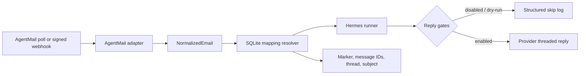

# hermes-email-bridge

`hermes-email-bridge` routes inbound email into [Hermes Agent](https://github.com/NousResearch/hermes-agent). It normalizes provider payloads, maps email threads to Hermes sessions, invokes Hermes, and can send the response back through the email provider.

AgentMail is the first adapter, not a core dependency. The bridge contract is intentionally small enough for future IMAP, Gmail API, Postmark, SendGrid, or SES adapters.

> Status: alpha. Start with replies disabled and dry-run enabled.

## What works

- AgentMail polling, message inspection, threaded replies, and verified webhooks
- Provider-neutral typed message and attachment models
- SQLite mappings by opaque bridge marker, `In-Reply-To`, `References`, provider thread, then exact normalized subject
- Hermes session creation and resume through its non-interactive CLI
- JSON structured logs with secret-field redaction
- Persistent poll cursor, processed-message idempotency, and optional raw payload storage
- No runtime Python dependencies

## Install

Python 3.11 or newer is required.

```bash
git clone https://github.com/aulbricht/hermes-email-bridge.git
cd hermes-email-bridge
python -m venv .venv
source .venv/bin/activate
python -m pip install -e .
cp .env.example .env
```

Edit `.env`, then export it before invoking the CLI:

```bash
set -a
source .env
set +a
```

The bridge does not parse `.env` itself, avoiding a runtime dependency and keeping secret loading under the process supervisor's control.

## Configure

| Variable | Default | Purpose |
| --- | --- | --- |
| `EMAIL_BRIDGE_PROVIDER` | `agentmail` | Active provider adapter |
| `AGENTMAIL_API_KEY` | required | AgentMail bearer API key |
| `AGENTMAIL_INBOX_ID` | required | Inbox address or ID |
| `AGENTMAIL_WEBHOOK_SECRET` | required by `serve` | Svix signing secret (`whsec_…`) |
| `EMAIL_BRIDGE_DB_PATH` | `~/.local/state/hermes-email-bridge/bridge.db` | SQLite database |
| `EMAIL_BRIDGE_SEND_REPLIES` | `false` | Allow outbound replies |
| `EMAIL_BRIDGE_DRY_RUN` | `true` | Skip provider send even when replies are enabled |
| `EMAIL_BRIDGE_STORE_RAW` | `true` | Persist raw provider payloads for debugging |
| `EMAIL_BRIDGE_POLL_INTERVAL` | `30` | Continuous poll interval in seconds |
| `EMAIL_BRIDGE_LOG_LEVEL` | `INFO` | Python log level |
| `HERMES_COMMAND` | `hermes chat --quiet --source tool` | Shell-free Hermes command prefix |
| `HERMES_PROFILE` | `default` | Profile metadata exported to Hermes |
| `HERMES_TIMEOUT` | `300` | Invocation timeout in seconds |
| `EMAIL_BRIDGE_WEBHOOK_HOST` | `127.0.0.1` | Webhook listen host |
| `EMAIL_BRIDGE_WEBHOOK_PORT` | `8787` | Webhook listen port |

For a named Hermes profile, point `HERMES_COMMAND` at that profile's Hermes wrapper. The bridge appends `--resume SESSION` when mapped and always appends `--query PROMPT`; it never invokes a shell.

## Use

Initialize the mapping database:

```bash
hermes-email-bridge init-db
```

Poll once, or continuously:

```bash
hermes-email-bridge poll
hermes-email-bridge poll --continuous --interval 15
```

Inspect how a provider message normalizes (add `--raw` to include the raw payload):

```bash
hermes-email-bridge inspect '<message-id@agentmail.to>'
```

List persistent mappings:

```bash
hermes-email-bridge mappings
```

Run the webhook receiver:

```bash
hermes-email-bridge serve
curl http://127.0.0.1:8787/healthz
```

Expose `/webhooks` through HTTPS and register it for AgentMail's `message.received` event. `serve` refuses to start without `AGENTMAIL_WEBHOOK_SECRET` and verifies the exact raw body using AgentMail's Svix headers before parsing it. See AgentMail's [webhook setup](https://docs.agentmail.to/webhooks-overview) and [verification](https://docs.agentmail.to/webhook-verification) guides.

To enable actual replies, change both safety gates deliberately:

```bash
export EMAIL_BRIDGE_SEND_REPLIES=true
export EMAIL_BRIDGE_DRY_RUN=false
```

AgentMail's reply endpoint preserves the original email thread, including `In-Reply-To` and `References` semantics.

## Seed a mapping

Inbound mail with no existing mapping starts a new Hermes session. The runner captures the `session_id:` emitted by Hermes and persists the new thread mapping automatically.

For a message originally sent elsewhere, seed its outbound message ID before replies arrive:

```python
from hermes_email_bridge.store import MappingStore

with MappingStore("bridge.db") as store:
    mapping = store.add_mapping(
        provider="agentmail",
        hermes_session="20260709_120000_abc123",
        hermes_topic="client-onboarding",
        provider_thread_id="thd_123",
        subject="Welcome to Hermes",
        participant_email="person@example.com",
        message_ids=("<outbound-message@agentmail.to>",),
    )
    print(f"X-Hermes-Bridge: v1:{mapping.bridge_marker}")
```

The marker is a random opaque capability that only selects an existing database mapping. It does not encode a session, command, or configuration value.

## Architecture



The provider boundary is [`EmailProvider`](src/hermes_email_bridge/providers/base.py). An adapter implements `poll`, `get`, and `reply`; webhook parsing is optional. Core orchestration has no AgentMail imports.

Resolution order is:

1. Existing opaque bridge marker from provider metadata or `X-Hermes-Bridge`
2. `In-Reply-To`, then newest-to-oldest `References`
3. Provider thread ID
4. Exact normalized subject, preferring the same correspondent

Every successful match links the inbound and outbound message IDs to the mapping, improving subsequent reply matching.

## Trust boundary

Email is untrusted user content. The bridge never reads commands, session IDs, routing values, or configuration from the body or subject. The body is passed to Hermes inside an explicit user-content boundary; only configured values, verified provider fields, and existing opaque mapping capabilities control the bridge.

Additional safeguards:

- Webhook HMAC signature and five-minute timestamp verification
- Configurable replies plus independent dry-run gate
- No shell evaluation of `HERMES_COMMAND`
- API keys and webhook secrets never logged
- Processed message IDs prevent duplicate Hermes invocations
- Raw payloads are stored only in SQLite, never emitted in normal logs

Raw emails can contain sensitive data. Protect the SQLite database or set `EMAIL_BRIDGE_STORE_RAW=false`.

## Development

```bash
uv sync --extra dev
uv run pytest
uv run ruff check .
uv run mypy
uv run python -m build
```

Tests cover normalization, all requested mapping paths, SQLite persistence, dry-run behavior, the fake provider contract, the subprocess runner, and webhook verification.

## AgentMail notes and current limits

The adapter targets AgentMail's documented `/v0/inboxes/:inbox_id/messages` list/get/reply endpoints. Polling uses an overlapping timestamp cursor plus persistent message-ID deduplication because the list API exposes time and page filters rather than a durable event cursor.

Current deliberate limits:

- Attachment metadata is normalized; attachment content is not downloaded or sent to Hermes.
- WebSockets are not implemented because polling and production webhooks cover the initial use cases.
- One process is configured for one AgentMail inbox.
- A provider reply failure is recorded and logged but is not automatically retried; use the log context for manual recovery.

See the current AgentMail [message API](https://docs.agentmail.to/messages) and [list endpoint](https://docs.agentmail.to/api-reference/inboxes/messages/list) for upstream behavior.

## License

MIT
