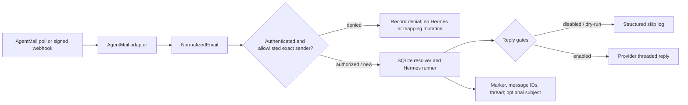

# hermes-email-bridge

`hermes-email-bridge` routes inbound email into [Hermes Agent](https://github.com/NousResearch/hermes-agent). It normalizes provider payloads, maps email threads to Hermes sessions, invokes Hermes, and can send the response back through the email provider.

AgentMail is the first adapter, not a core dependency. The bridge contract is intentionally small enough for future IMAP, Gmail API, Postmark, SendGrid, or SES adapters.

> Version: **0.3.0 (alpha)**. Start with replies disabled and dry-run enabled.

## What works

- Direct or Composio-backed AgentMail polling, message inspection, threaded replies, and verified webhooks
- Provider-neutral typed message and attachment models
- Authorization-aware SQLite mappings bound to a provider-authenticated participant
- Hermes session creation and resume through its non-interactive CLI
- JSON structured logs with secret-field redaction
- Persistent poll cursor, processed-message idempotency, and optional raw payload storage
- Exact sender allowlisting with automatic enrollment from trusted outbound mail
- No runtime Python dependencies

## Install

Python 3.11 or newer is required. The default macOS Python 3.9 is not supported.

### Recommended: uv

```bash
git clone https://github.com/aulbricht/hermes-email-bridge.git
cd hermes-email-bridge
uv sync
cp .env.example .env
```

For development tools and tests, use `uv sync --extra dev`. Run commands with
`uv run`, for example `uv run hermes-email-bridge init-db`.

### pip fallback

Create the virtual environment with Python 3.11 or newer explicitly, then update
pip before requesting an editable Hatchling install:

```bash
python3.11 -m venv .venv
source .venv/bin/activate
python -m pip install --upgrade pip
python -m pip install -e .
cp .env.example .env
```

Edit `.env`, then export it before invoking the CLI:

```bash
set -a
source .env
set +a
```

The bridge does not parse `.env` itself, avoiding a runtime dependency and keeping secret loading under the process supervisor's control.

## Configure

| Variable | Default | Purpose |
| --- | --- | --- |
| `EMAIL_BRIDGE_PROVIDER` | `agentmail` | `agentmail` or `composio-agentmail` |
| `AGENTMAIL_API_KEY` | required | AgentMail bearer API key |
| `AGENTMAIL_INBOX_ID` | required | Inbox address or ID |
| `AGENTMAIL_WEBHOOK_SECRET` | required by `serve` | Svix signing secret (`whsec_…`) |
| `EMAIL_BRIDGE_DB_PATH` | `~/.local/state/hermes-email-bridge/bridge.db` | SQLite database |
| `EMAIL_BRIDGE_SEND_REPLIES` | `false` | Allow outbound replies |
| `EMAIL_BRIDGE_DRY_RUN` | `true` | Skip provider send even when replies are enabled |
| `AGENTMAIL_BASE_URL` | `https://api.agentmail.to/v0` | HTTPS AgentMail API base URL |
| `AGENTMAIL_ALLOW_INSECURE_LOCAL_HTTP` | `false` | Permit HTTP only to `localhost` or a loopback IP for local tests |
| `EMAIL_BRIDGE_COMPOSIO_API_KEY` | required for Composio | Bridge-only project key scoped to Proxy Execute |
| `COMPOSIO_AGENT_MAIL_CONNECTED_ACCOUNT_ID` | required for Composio | Active AgentMail connected account |
| `COMPOSIO_AGENT_MAIL_INBOX_ID` | required for Composio | AgentMail inbox address or ID |
| `EMAIL_BRIDGE_STORE_RAW` | `false` | Persist raw provider payloads for debugging |
| `EMAIL_BRIDGE_RAW_RETENTION_DAYS` | `30` | Logical retention limit for opted-in raw payloads |
| `EMAIL_BRIDGE_ALLOW_SUBJECT_RESUME` | `false` | Enable authenticated exact-participant subject fallback |
| `EMAIL_BRIDGE_POLL_INTERVAL` | `30` | Continuous poll interval in seconds |
| `EMAIL_BRIDGE_LOG_LEVEL` | `INFO` | Python log level |
| `HERMES_COMMAND` | `hermes chat --quiet --source tool` | Shell-free command prefix; production must use the isolated sudo wrapper below |
| `HERMES_TIMEOUT` | `300` | Invocation timeout in seconds |
| `EMAIL_BRIDGE_WEBHOOK_HOST` | `127.0.0.1` | Webhook listen host |
| `EMAIL_BRIDGE_WEBHOOK_PORT` | `8787` | Webhook listen port |
| `EMAIL_BRIDGE_WEBHOOK_QUEUE_SIZE` | `8` | Accepted webhook events waiting for a worker |

The bridge appends `--resume SESSION` when mapped and always appends `--query PROMPT`; it
never invokes a shell. The built-in command default is for local development only. A production
email bridge must use the fixed isolated wrapper described below, not a same-user Hermes profile.

## Use

Initialize the mapping database. For a fresh production deployment, seed both
poll cursors to the current UTC time so existing received and sent mail is not imported:

```bash
hermes-email-bridge init-db
hermes-email-bridge init-db --start-now
```

The bridge denies every sender until an exact address is authorized. Wildcards and
domain entries are not accepted:

```bash
hermes-email-bridge allowlist add person@example.com
hermes-email-bridge allowlist list
hermes-email-bridge allowlist remove person@example.com
```

Each poll cycle reads trusted `sent` messages before `received` messages. Valid To,
Cc, and Bcc recipients on new messages sent from the configured inbox are added to
the allowlist automatically. Removing an address remains effective across cursor
overlap and restarts; only a later, newly observed outbound message can authorize it again.

Poll once, or continuously:

```bash
hermes-email-bridge poll
hermes-email-bridge poll --continuous --interval 15
```

Inspect how a provider message normalizes (add `--raw` to include the raw payload):

```bash
hermes-email-bridge inspect '<message-id@agentmail.to>'
```

List persistent mappings:

```bash
hermes-email-bridge mappings
```

Markers are masked in this output. Rotate one marker and reveal the replacement once:

```bash
hermes-email-bridge mappings rotate 1 --ttl-days 90
```

Purge retained raw payloads without deleting processed-message idempotency records:

```bash
hermes-email-bridge purge-raw --older-than-days 30
```

Run the webhook receiver:

```bash
hermes-email-bridge serve
curl http://127.0.0.1:8787/healthz
```

Expose `/webhooks` through HTTPS and register it for AgentMail's `message.received` event. `serve` refuses to start without `AGENTMAIL_WEBHOOK_SECRET` and verifies the exact raw body using AgentMail's Svix headers before parsing it. Verified events enter a bounded queue and one worker processes them serially so messages cannot race to create or resume the same Hermes session; saturation returns HTTP 503 so the provider can retry. See AgentMail's [webhook setup](https://docs.agentmail.to/webhooks-overview) and [verification](https://docs.agentmail.to/webhook-verification) guides.

To enable actual replies, change both safety gates deliberately. Authentication and
allowlist checks still apply before Hermes invocation, mapping changes, or replies:

```bash
export EMAIL_BRIDGE_SEND_REPLIES=true
export EMAIL_BRIDGE_DRY_RUN=false
```

AgentMail's reply endpoint preserves the original email thread, including `In-Reply-To` and `References` semantics.

## Seed a mapping

Inbound mail with no existing mapping starts a new Hermes session. The runner captures the `session_id:` emitted by Hermes and persists the new thread mapping automatically.

For a message originally sent elsewhere, seed its outbound message ID before replies arrive:

```python
from hermes_email_bridge.store import MappingStore

with MappingStore("bridge.db") as store:
    mapping = store.add_mapping(
        provider="agentmail",
        hermes_session="20260709_120000_abc123",
        hermes_topic="client-onboarding",
        provider_thread_id="thd_123",
        subject="Welcome to Hermes",
        participant_email="person@example.com",
        message_ids=("<outbound-message@agentmail.to>",),
    )
    print(f"X-Hermes-Bridge: v1:{mapping.bridge_marker}")
```

The marker is a random opaque capability that only selects an existing database mapping. It does not encode a session, command, or configuration value. New markers expire after 90 days by default and are valid only for the mapping's authenticated participant.

`X-Hermes-Bridge` is still a bearer capability visible to every email recipient and to mail infrastructure that handles the message. Do not reuse or publish it; rotate it if the recipient set changes or a message containing it is exposed.

## Architecture



The provider boundary is [`EmailProvider`](src/hermes_email_bridge/providers/base.py). An adapter implements `poll`, `get`, and `reply`; webhook parsing is optional. Core orchestration has no AgentMail imports.

Resolution order is:

1. Existing opaque bridge marker from provider metadata or `X-Hermes-Bridge`
2. `In-Reply-To`, then newest-to-oldest `References`
3. Provider thread ID
4. Exact normalized subject and participant, only when `EMAIL_BRIDGE_ALLOW_SUBJECT_RESUME=true`

Every inbound path is an authorization decision: the provider must classify the sender as authenticated, the exact normalized sender must be allowlisted, and a resumed mapping must match its non-null participant. AgentMail authentication comes only from its signed event type or API `received`/`unauthenticated` classification. Raw `Authentication-Results` headers are untrusted and ignored. Failed, missing, unknown, or unallowlisted senders never invoke Hermes, send a reply, or change a mapping.

Every authorized match links the inbound and outbound message IDs to the mapping, improving subsequent reply matching. Provider thread IDs are unique per authenticated participant; conflicting attempts cannot overwrite an existing Hermes session.

Threaded replies explicitly target only the normalized, authenticated, allowlisted `From`
address and set `reply_all=false`. Untrusted `Reply-To`, Cc, and Bcc values can never select
reply recipients.

## Trust boundary

Email is untrusted user content. The bridge never reads commands, session IDs, routing values, or configuration from the body or subject. The body is passed to Hermes inside an explicit user-content boundary; only configured values, verified provider fields, and existing opaque mapping capabilities control the bridge.

Additional safeguards:

- Webhook HMAC signature and five-minute timestamp verification
- Configurable replies plus independent dry-run gate
- No shell evaluation of `HERMES_COMMAND`
- Minimal Hermes child environment: only `PATH` and present locale fields reach the command
- Production Hermes runs as a separate non-staff account through a root-owned fixed wrapper
- API keys and webhook secrets never logged
- Processed message IDs plus in-process webhook coalescing prevent duplicate Hermes invocations
- AgentMail bearer credentials are sent only to a validated HTTPS origin; redirects are rejected
- Composio requests use one fixed HTTPS origin and fixed AgentMail `/v0` paths; upstream bodies and headers are never logged
- Raw payloads default off and, when enabled, are stored only in SQLite and logically purged after the configured retention period

Raw emails can contain sensitive data. Leave `EMAIL_BRIDGE_STORE_RAW=false` unless debugging requires them. The bridge creates a new state directory with mode `0700` and a new database with mode `0600` on POSIX systems, but existing directories, database copies, SQLite sidecars, and backups remain the operator's responsibility. Logical purge sets expired payloads to `NULL`; use your normal SQLite maintenance if physical page reclamation is required.

## Development

```bash
uv sync --extra dev
uv run pytest
uv run ruff check .
uv run mypy
uv run python -m build
```

Tests cover authentication and spoofing rejection, every mapping path, schema migration, marker rotation and expiry, raw retention, URL and redirect rejection, bounded webhook processing, normalization, dry-run behavior, the subprocess runner, and Svix verification.

## Composio transport

Set `EMAIL_BRIDGE_PROVIDER=composio-agentmail` to keep the AgentMail credential in
Composio. The adapter calls only Composio's fixed v3.1 Proxy Execute endpoint and
allows only the AgentMail message-list, message-get, and threaded-reply paths. It has
no SDK dependency and does not require a Composio user ID or auth-config ID.

Create a dedicated Composio project API key with only the **Proxy Execute** permission.
Do not reuse another application's broad automation key. The connected account and inbox must already
exist and be active. Polling defaults to 30 seconds; transient network, HTTP 429, and 5xx
failures use capped exponential backoff and safe `Retry-After` values. Authentication,
configuration, and malformed-response failures stop rather than retry forever.

## macOS LaunchAgent

Generic templates live in `deploy/macos`. The bridge remains a user LaunchAgent, but
email-driven Hermes runs as the separate hidden `_hermesmail` account. Do not run either
component from the repository or from another Hermes user's state directory.

1. Create separate workspace, configuration, state, and log directories with mode `0700`.
2. Copy `run-email-bridge.sh` into the install directory and keep it executable.
3. Put only required configuration in the environment file, set
   `EMAIL_BRIDGE_VENV` to the Python 3.11+ environment, then set the file to mode `0600`.
4. Replace every `__PLACEHOLDER__` in the plist, including a unique label, absolute paths,
   and a neutral bridge `HOME`. Keep the plist free of secrets.
5. Run `init-db --start-now`, add initial exact addresses with `allowlist add`, run the fixed
   runtime verifier and live canary below, then load the plist as a user LaunchAgent.

The launcher runs the root-owned fixed runtime verifier before reading the bridge environment
file, so a stale or modified runtime fails before bridge secrets enter the process. The template
uses umask `077`, a neutral working directory, stderr-only logging,
`RunAtLoad`, restart after unsuccessful exit, and a 30-second launchd throttle. The bridge
does not internally retry permanent authentication, configuration, or malformed-response
failures; launchd will still restart an unsuccessful process, so unload the LaunchAgent while
correcting a persistent configuration failure.
Protect the database, SQLite sidecars, environment, workspace, and logs from other users.
A user LaunchAgent starts only after login; with FileVault enabled, it cannot run before
the user unlocks and logs into the Mac after reboot.

### Isolated Hermes account and wrapper

Before installation, list existing IDs with `dscl . -list /Users UniqueID` and
`dscl . -list /Groups PrimaryGroupID`. Choose unused values for `__SERVICE_UID__` and
`__SERVICE_GID__`, then rerun both checks immediately before creation. As root, create the
hidden non-staff account and group:

```bash
dscl . -create /Groups/_hermesmail
dscl . -create /Groups/_hermesmail PrimaryGroupID __SERVICE_GID__
dscl . -create /Users/_hermesmail
dscl . -create /Users/_hermesmail UniqueID __SERVICE_UID__
dscl . -create /Users/_hermesmail PrimaryGroupID __SERVICE_GID__
dscl . -create /Users/_hermesmail NFSHomeDirectory /var/db/hermes-email-agent
dscl . -create /Users/_hermesmail UserShell /usr/bin/false
dscl . -create /Users/_hermesmail IsHidden 1
install -d -o _hermesmail -g _hermesmail -m 0700 /var/db/hermes-email-agent
install -d -o _hermesmail -g _hermesmail -m 0700 /var/db/hermes-email-agent/workspace
```

Verify the wrapper interpreter first with `test -x /usr/bin/python3`. Install Hermes Agent
**0.18.2** into the fixed, root-owned
`/Library/Application Support/HermesEmailAgent/hermes-agent` tree and verify the pinned
version before continuing. Its virtual-environment executable must be exactly
`/Library/Application Support/HermesEmailAgent/hermes-agent/venv/bin/hermes`; code and
environment files must not be writable by `_hermesmail`. Configure only the inference-only
`openai-codex` authentication required for model `gpt-5.5` under
`/var/db/hermes-email-agent`. Never copy or reuse another user's profile, auth files, home,
Composio connection, hooks, plugins, rules, skills, or `HERMES_HOME`.

The stdlib-only installer preflights `/usr`, `/usr/local`, `/usr/local/libexec`,
`/private/etc`, and canonical `/private/etc/sudoers.d` with `lstat` (the policy remains
visible through macOS's system `/etc` link); it rejects symlinks, wrong root:wheel ownership,
group/other write access, and unexpected ACLs. It safely creates a missing
`/usr/local/libexec` as root:wheel `0755`, validates the rendered policy with `visudo`,
then atomically installs the wrapper as root:wheel `0755` and sudoers policy as root:wheel
`0440`. The installer intentionally supports macOS system Python 3.9.6. Validate its plan
first, then install as root:

Both files are staged and validated before replacement. Existing content, ownership, and
modes are preserved as rollback snapshots; a replacement, final path, ACL, or final `visudo`
failure restores both files and removes a newly-created empty `libexec` directory.

```bash
/usr/bin/python3 deploy/macos/install-hermes-email-agent.py \
  --bridge-user YOUR_BRIDGE_ACCOUNT --dry-run
sudo /usr/bin/python3 deploy/macos/install-hermes-email-agent.py \
  --bridge-user YOUR_BRIDGE_ACCOUNT --check
sudo /usr/bin/python3 deploy/macos/install-hermes-email-agent.py \
  --bridge-user YOUR_BRIDGE_ACCOUNT
```

The sudoers rule grants the bridge account only the exact root-owned wrapper as
`_hermesmail`. The wrapper accepts only `--query TEXT` with one optional safe `--resume
SESSION_ID`; it fixes the working directory, environment, executable, and Hermes arguments:
safe mode, `context_engine`, `openai-codex`, `gpt-5.5`, and one turn. It cannot select arbitrary
providers, models, tools, toolsets, hooks, skills, flags, or commands. Configure the bridge:

```bash
HERMES_COMMAND='/usr/bin/sudo -n -H -u _hermesmail /usr/local/libexec/hermes-email-agent'
```

Hermes 0.18.2 safe mode skips plugins, MCP configuration, hooks, rules, and skills. The
reviewed commit is unsigned, so do not trust a version banner, mutable branch, local clone,
or locally generated `git archive`. Fetch only:

```text
https://codeload.github.com/NousResearch/hermes-agent/tar.gz/4281151ae859241351ba14d8c7682dc67ff4c126
```

Its independently verified SHA-256 is
`731f785d0373c81e7fb3d18ac5f4a1b6f9d6e3b94d2ae56a5b63133045bd2c68`. The fetcher uses
that fixed HTTPS URL without environment proxies or redirects, caps transfer/extraction,
rejects unsafe archive members, records commit/archive/source provenance, verifies source
version 0.18.2, requires the staging parent and installed tree to remain owned by the
installer account without group/other write access, rejects named and inherited ACLs, and
atomically stages the source. Its production CLI accepts only the fixed path. It anchors and
validates `/` and `/Library` as root:wheel `0755`, `/Library/Application Support` as root:admin
`0755`, and the created `HermesEmailAgent`, `hermes-agent`, and `source` directories as
root:wheel `0755` using no-follow directory descriptors:

```bash
sudo /usr/bin/python3 deploy/macos/fetch-hermes-email-agent.py
/usr/bin/python3 deploy/macos/fetch-hermes-email-agent.py --verify
```

The reviewed source's `uv.lock` SHA-256 is
`8d03d04a404c641e1c9642f0482e2d8752c57da02da94d612a5f30883b25fbca`. Install the
reviewed arm64 macOS `uv` 0.11.16 binary at the one fixed root-owned path. The official archive
SHA-256 is `2b25be1af546be330b340b0a76b99f989daa6d92678fdffb87438e661e9d88fb`; the extracted
`uv` binary SHA-256 is `f63ec276fa13f8f392542a334c0f58f36833b24304831e5f4c221e2edf7a16f3`:

```bash
uv_stage=$(mktemp -d)
curl --proto '=https' --tlsv1.2 --fail --location --silent --show-error \
  https://github.com/astral-sh/uv/releases/download/0.11.16/uv-aarch64-apple-darwin.tar.gz \
  --output "$uv_stage/uv.tar.gz"
echo '2b25be1af546be330b340b0a76b99f989daa6d92678fdffb87438e661e9d88fb  uv.tar.gz' \
  | (cd "$uv_stage" && shasum -a 256 -c -)
tar -xzf "$uv_stage/uv.tar.gz" -C "$uv_stage"
echo 'f63ec276fa13f8f392542a334c0f58f36833b24304831e5f4c221e2edf7a16f3  uv' \
  | (cd "$uv_stage/uv-aarch64-apple-darwin" && shasum -a 256 -c -)
sudo install -o root -g wheel -m 0755 \
  "$uv_stage/uv-aarch64-apple-darwin/uv" /usr/local/libexec/hermes-email-uv
rm -rf "$uv_stage"
```

The Python 3.9-compatible runtime installer re-verifies source and lock provenance, then runs
only that pinned `uv` as the unprivileged `_hermesmail` account with a minimal proxy-free
environment. It uses `sync --frozen --no-dev --no-editable --python 3.11`, the exact fixed
`UV_PROJECT_ENVIRONMENT`, and fixed managed-Python/cache/temp directories. Building as the
unprivileged account prevents upstream build tooling from modifying the root-owned reviewed
source. After a second source verification, it removes build state, changes the managed Python
and venv trees to root:wheel, rejects writable paths, escaping symlinks, and ACLs, and installs
the fixed verifier assets:

```bash
sudo /usr/bin/python3 deploy/macos/install-hermes-email-runtime.py --check
sudo /usr/bin/python3 deploy/macos/install-hermes-email-runtime.py
```

The resulting root-owned `runtime-attestation.json` binds the archive, commit, source and lock
digests, pinned `uv`, managed Python, console entrypoint, fixed verifier assets, and a canonical
digest of every runtime file. Verification rejects editable installs, unexpected `direct_url`,
imports outside the fixed venv's site-packages, wrong entrypoint/shebang, stale dependencies,
writable paths, unsafe ownership/modes, ACLs, or changed runtime files.

At the reviewed source, the wrapper's `--toolsets context_engine` validates, resolves to an empty
tool list, and exposes zero schemas in safe mode. The values `none`, `no_mcp`, empty, and
default fallbacks are forbidden.

Before initial start and every Hermes upgrade, keep the LaunchAgent unloaded and verify the
attestation. This read-only command is also executed automatically on every LaunchAgent start,
before the environment file is sourced:

```bash
/usr/local/libexec/verify-hermes-email-agent.py
```

The verifier checks the actual fixed Python, `hermes` console script, non-editable distribution,
import origins, lock/version, exactly zero tool schemas for `context_engine`, and offline
new/resume parser shapes. Every offline install and startup probe creates its own invoking-user-owned
mode `0700` temporary `HOME`/`HERMES_HOME` outside `/var/db/hermes-email-agent` and removes it on
success or failure. Offline verification never reads or changes the real service home.
It does not claim that a model answered. Before loading the LaunchAgent, separately run the live
canary from the bridge account:

```bash
/usr/local/libexec/verify-hermes-email-agent.py --live
```

Do not load or restart unless attestation succeeds and the live canary returns the exact new and
resumed answers with only `session_id:` metadata on stderr and no warning. Resume remains enabled
because the bridge requires persisted sessions.

The bridge command receives only `PATH` and present locale fields; it receives no bridge
environment-file path, AgentMail/Composio/bridge variables, proxy variables, `PYTHONPATH`,
`HOME`, `HERMES_HOME`, or bridge metadata. The wrapper then replaces that environment with
its fixed service-account environment. Same-user `0600` files alone are not an isolation
boundary against an email-driven agent.

## Release notes

### 0.3.0

- Added Composio Proxy Execute transport for AgentMail without new runtime dependencies.
- Added authenticated exact-address allowlisting and automatic trusted-sent enrollment.
- Added no-history cursor seeding, transient polling backoff, and macOS LaunchAgent templates.
- Restricted replies to authenticated `From` and added separate-account Hermes isolation assets.
- Consolidated runtime version reporting on package metadata from `pyproject.toml`.

## AgentMail notes and current limits

The adapter targets AgentMail's documented `/v0/inboxes/:inbox_id/messages` list/get/reply endpoints. Polling uses an overlapping timestamp cursor plus persistent message-ID deduplication because the list API exposes time and page filters rather than a durable event cursor.

Current deliberate limits:

- Attachment metadata is normalized; attachment content is not downloaded or sent to Hermes.
- WebSockets are not implemented because polling and production webhooks cover the initial use cases.
- One process is configured for one AgentMail inbox.
- Webhook duplicate coalescing is in-process; multi-process deployments need a durable database claim or lease.
- A provider reply failure is recorded and logged but is not automatically retried; use the log context for manual recovery.

See the current AgentMail [message API](https://docs.agentmail.to/messages) and [list endpoint](https://docs.agentmail.to/api-reference/inboxes/messages/list) for upstream behavior.

## License

MIT
